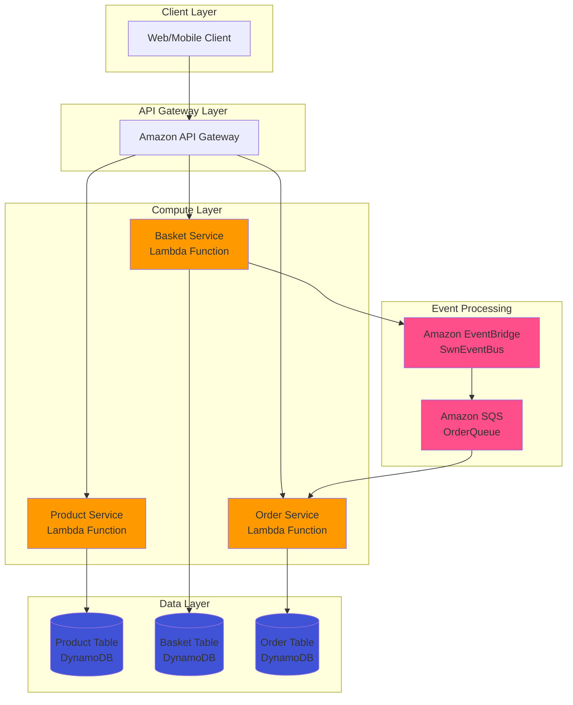
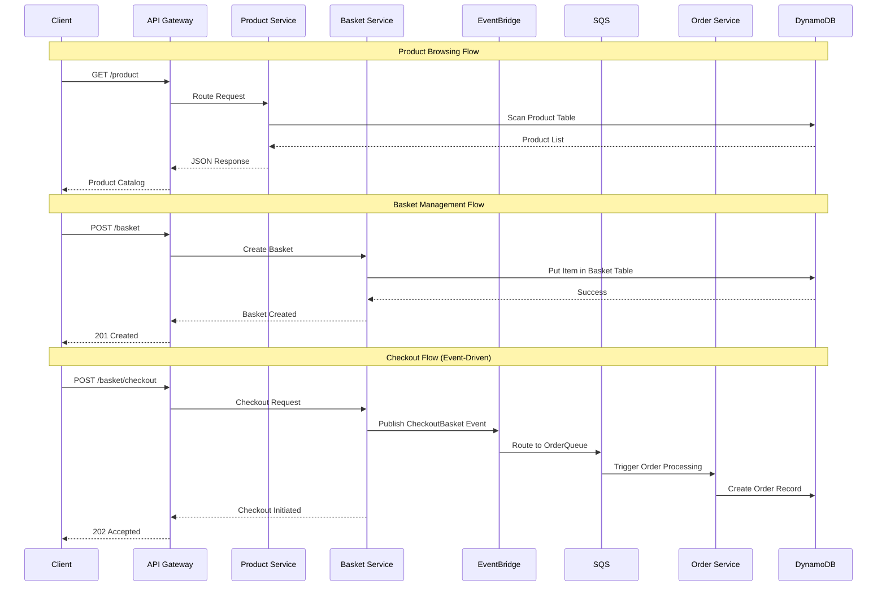

# AWS Serverless Event-Driven E-commerce Microservices Architecture

[](https://aws.amazon.com/)
[](https://aws.amazon.com/lambda/)
[](https://aws.amazon.com/dynamodb/)
[](https://aws.amazon.com/api-gateway/)
[](https://aws.amazon.com/cdk/)

## 📋 Table of Contents
- [Latest Updates](#-latest-updates)
- [Solution Overview](#-solution-overview)
- [Architectural Visualization](#-architectural-visualization)
- [Architecture Details](#-architecture-details)
- [Features and Capabilities](#-features-and-capabilities)
- [Deployment Framework](#-deployment-framework)
- [Prerequisites and Setup](#-prerequisites-and-setup)
- [Implementation Guide](#-implementation-guide)
- [Security Considerations](#-security-considerations)
- [Project Structure](#-project-structure)
- [Contributing](#-contributing)
- [References](#-references)

## 🚀 Latest Updates

### Version 2.1.0 - Production Ready
- **Release Date**: October 2025
- **CDK Version**: 2.17.0
- **Node.js Runtime**: 14.x LTS

#### 🔥 Key Changes
- ✅ Enhanced product service with comprehensive CRUD operations
- ✅ Implemented robust event-driven architecture with EventBridge
- ✅ Added SQS integration for reliable message processing
- ✅ Optimized DynamoDB schema with proper indexing strategies
- ✅ Comprehensive error handling and logging across all services
- ✅ Production-ready security configurations

#### 🛠️ Technical Improvements
- Auto-generated UUID v4 for product identification
- Marshall/unmarshall utilities for DynamoDB operations
- Event filtering and routing optimization
- Pay-per-request billing mode for cost optimization

---

## 🎯 Solution Overview

### Problem Statement
Modern e-commerce platforms require a scalable, resilient, and cost-effective architecture that can handle varying loads while maintaining high availability. Traditional monolithic architectures struggle with:

- **Scalability bottlenecks** during peak traffic
- **Single points of failure** affecting entire systems
- **Tight coupling** between business domains
- **Inefficient resource utilization** leading to high operational costs
- **Complex deployment processes** slowing down development cycles

### Architectural Approach

This solution implements a **serverless, event-driven microservices architecture** that emphasizes:

#### 🏗️ **Modularity**
- **Domain-Driven Design**: Each microservice owns its data and business logic
- **Loose Coupling**: Services communicate through events and APIs
- **Independent Deployment**: Services can be deployed and scaled independently

#### 📈 **Scalability**
- **Auto-scaling**: Lambda functions scale automatically based on demand
- **Pay-per-use**: No idle server costs with serverless architecture
- **Horizontal Scaling**: DynamoDB scales seamlessly with traffic patterns

#### 🔒 **Security**
- **Zero-trust Architecture**: All services authenticate and authorize requests
- **Encryption**: Data encrypted at rest and in transit
- **Least Privilege Access**: IAM roles with minimal required permissions

### AWS Services Architecture

| Service | Purpose | Implementation Details |
|---------|---------|----------------------|
| **AWS Lambda** | Compute Engine | Serverless functions for business logic execution |
| **Amazon API Gateway** | API Management | RESTful APIs with request/response transformation |
| **Amazon DynamoDB** | NoSQL Database | High-performance data storage with global secondary indexes |
| **Amazon EventBridge** | Event Bus | Decoupled event routing between microservices |
| **Amazon SQS** | Message Queue | Reliable message delivery with dead letter queues |
| **AWS CDK** | Infrastructure as Code | Type-safe infrastructure deployment and management |

### Security Features

#### 🔐 **Authentication & Authorization**
- **IAM Roles**: Fine-grained permissions for each service
- **Resource-based Policies**: Secure access to DynamoDB tables and SQS queues
- **API Gateway Security**: Request validation and throttling

#### 🔒 **Data Protection**
- **Encryption at Rest**: DynamoDB encryption with AWS managed keys
- **Encryption in Transit**: HTTPS/TLS for all API communications
- **Data Validation**: Input sanitization and schema validation

#### 📊 **Monitoring & Compliance**
- **CloudWatch Logging**: Comprehensive application and infrastructure logs
- **X-Ray Tracing**: Distributed request tracing and performance monitoring
- **CloudTrail Integration**: API call auditing and compliance tracking

---

## 🏛️ Architectural Visualization

### System Architecture Diagram



### User Request Flow

#### 🛒 **E-commerce User Journey**



### Core Technology Stack

#### **Backend Services**
- **Runtime**: Node.js 14.x LTS
- **Language**: JavaScript (ES6+)
- **SDK**: AWS SDK v3 (Modular Architecture)
- **Database**: Amazon DynamoDB (NoSQL)

#### **Infrastructure**
- **IaC Framework**: AWS CDK 2.17.0 (TypeScript)
- **Deployment**: AWS CloudFormation
- **Monitoring**: CloudWatch + X-Ray
- **Security**: IAM Roles & Policies

#### **Development Tools**
- **Build System**: TypeScript Compiler
- **Testing**: Jest Framework
- **Package Manager**: npm
- **Version Control**: Git

---

## 🔧 Architecture Details

### Component Breakdown

#### 🏪 **Product Microservice**
**Responsibility**: Product catalog management and inventory operations

**Key Features**:
- ✅ CRUD operations for product entities
- ✅ Category-based product filtering
- ✅ UUID-based unique product identification
- ✅ Comprehensive input validation
- ✅ Optimized DynamoDB queries with proper indexing

**API Endpoints**:
```
GET    /product           # List all products
POST   /product           # Create new product
GET    /product/{id}      # Get product by ID
PUT    /product/{id}      # Update product
DELETE /product/{id}      # Delete product
```

**Data Schema**:
```json
{
  "id": "uuid-v4",
  "name": "string",
  "description": "string",
  "imageFile": "string",
  "price": "number",
  "category": "string"
}
```

#### 🛒 **Basket Microservice**
**Responsibility**: Shopping cart management and checkout orchestration

**Key Features**:
- ✅ User-specific basket management
- ✅ Real-time inventory updates
- ✅ Event-driven checkout process
- ✅ Integration with EventBridge for order initiation

**API Endpoints**:
```
GET    /basket               # List all baskets
POST   /basket               # Create/Update basket
GET    /basket/{userName}    # Get user's basket
DELETE /basket/{userName}    # Clear user's basket
POST   /basket/checkout      # Initiate checkout process
```

**Event Publishing**:
```json
{
  "Source": "com.swn.basket.checkoutbasket",
  "DetailType": "CheckoutBasket",
  "Detail": {
    "userName": "string",
    "totalPrice": "number",
    "items": []
  }
}
```

#### 📦 **Order Microservice**
**Responsibility**: Order processing and fulfillment management

**Key Features**:
- ✅ Event-driven order creation
- ✅ SQS message processing for reliability
- ✅ Order history and tracking
- ✅ Composite key design for efficient queries

**API Endpoints**:
```
GET /order                    # List all orders
GET /order/{userName}         # Get user orders (with date filtering)
```

**Data Schema**:
```json
{
  "userName": "partition-key",
  "orderDate": "sort-key-iso-string",
  "totalPrice": "number",
  "firstName": "string",
  "lastName": "string",
  "email": "string",
  "address": "object",
  "paymentMethod": "string",
  "cardInfo": "string"
}
```

### Integration Points

#### 🔄 **Event-Driven Communication**
- **EventBridge Rules**: Filter and route checkout events
- **SQS Integration**: Reliable message delivery with retry mechanisms
- **Dead Letter Queues**: Handle failed message processing

#### 🗄️ **Data Access Patterns**
- **Product Table**: Single table design with GSI for category queries
- **Basket Table**: User-centric partition key for quick lookups
- **Order Table**: Composite key design (userName + orderDate) for range queries

### Scalability Features

#### ⚡ **Auto-Scaling Mechanisms**
- **Lambda Concurrency**: Automatic scaling based on request volume
- **DynamoDB On-Demand**: Pay-per-request with automatic scaling
- **API Gateway**: Built-in throttling and caching capabilities

#### 🔄 **Redundancy & Resilience**
- **Multi-AZ Deployment**: Services deployed across multiple availability zones
- **SQS Visibility Timeout**: Message retry mechanisms for failed processing
- **EventBridge Retry Policies**: Automatic retry with exponential backoff

---

## ✨ Features and Capabilities

### 🚀 Core Business Features

#### **Product Management**
- ✅ **Comprehensive CRUD Operations**: Full lifecycle product management
- ✅ **Category-Based Organization**: Efficient product categorization and filtering
- ✅ **Real-time Inventory Updates**: Instant product availability updates
- ✅ **Rich Metadata Support**: Extensible product schema for complex data

#### **Shopping Cart Experience**
- ✅ **Persistent Basket State**: User baskets maintained across sessions  
- ✅ **Real-time Price Calculation**: Dynamic pricing with tax and discount support
- ✅ **Multi-item Management**: Bulk operations for cart modifications
- ✅ **Checkout Validation**: Comprehensive pre-checkout validation

#### **Order Processing**
- ✅ **Asynchronous Order Creation**: Non-blocking checkout experience
- ✅ **Event-Driven Workflow**: Reliable order processing pipeline
- ✅ **Order History & Tracking**: Complete audit trail for all orders
- ✅ **Date-Range Queries**: Efficient order retrieval with time-based filtering

### 📈 Scalability Features

#### **Horizontal Scaling**
- ✅ **Serverless Architecture**: Infinite horizontal scaling capability
- ✅ **Stateless Design**: Services scale independently without session dependencies
- ✅ **Event-Driven Decoupling**: Services scale based on individual demand patterns

#### **Performance Optimization**
- ✅ **DynamoDB Query Optimization**: Efficient data access patterns
- ✅ **Lambda Cold Start Mitigation**: Optimized function initialization
- ✅ **API Gateway Caching**: Response caching for frequently accessed data

### 🔒 Security & Compliance

#### **Data Protection**
- ✅ **End-to-End Encryption**: Data encrypted at rest and in transit
- ✅ **Input Sanitization**: Comprehensive validation and sanitization
- ✅ **SQL Injection Prevention**: NoSQL design eliminates injection attacks

#### **Access Control**
- ✅ **Principle of Least Privilege**: Minimal IAM permissions for each service
- ✅ **Resource-Based Policies**: Fine-grained access control for AWS resources
- ✅ **API Rate Limiting**: Built-in protection against abuse and DoS attacks

### 💰 Cost Efficiency

#### **Pay-Per-Use Model**
- ✅ **No Idle Costs**: Pay only for actual compute and storage usage
- ✅ **Automatic Resource Management**: No infrastructure provisioning overhead
- ✅ **Usage-Based Scaling**: Resources scale down during low traffic periods

#### **Operational Excellence**
- ✅ **Infrastructure as Code**: Reproducible and version-controlled deployments
- ✅ **Automated Monitoring**: Built-in observability without additional setup
- ✅ **Self-Healing Architecture**: Automatic recovery from transient failures

---

## 🚀 Deployment Framework

### Infrastructure Requirements

#### **AWS Account Prerequisites**
- ✅ **AWS Account**: Active AWS account with billing enabled
- ✅ **Region Compatibility**: Deployment available in all AWS commercial regions
- ✅ **Service Limits**: Default service limits sufficient for production workloads

#### **Required AWS Services**
| Service | Minimum Quota | Recommended |
|---------|---------------|-------------|
| **Lambda Functions** | 10 concurrent executions | 1000+ concurrent |
| **DynamoDB Tables** | 3 tables per region | 10+ tables |
| **API Gateway APIs** | 3 REST APIs | 10+ APIs |
| **SQS Queues** | 1 standard queue | 5+ queues |
| **EventBridge Rules** | 5 rules per bus | 50+ rules |

### Step-by-Step Deployment

#### **1. Environment Setup**
```bash
# Install AWS CLI v2
curl "https://awscli.amazonaws.com/awscli-exe-linux-x86_64.zip" -o "awscliv2.zip"
unzip awscliv2.zip
sudo ./aws/install

# Configure AWS credentials
aws configure
# AWS Access Key ID: [Your Access Key]
# AWS Secret Access Key: [Your Secret Key]
# Default region name: [us-east-1]
# Default output format: [json]

# Install Node.js 14.x LTS
curl -fsSL https://deb.nodesource.com/setup_14.x | sudo -E bash -
sudo apt-get install -y nodejs

# Install AWS CDK CLI
npm install -g aws-cdk@2.17.0

# Verify installation
cdk --version
# 2.17.0 (build xxxxxxx)
```

#### **2. Project Setup**
```bash
# Clone the repository
git clone <repository-url>
cd aws-microservices

# Install dependencies
npm install

# Verify CDK app
cdk ls
# AwsMicroservicesStack

# Bootstrap CDK (first time only)
cdk bootstrap
```

#### **3. Infrastructure Deployment**
```bash
# Synthesize CloudFormation template (optional)
cdk synth

# Deploy to AWS
cdk deploy

# Deploy with auto-approval for CI/CD
cdk deploy --require-approval never

# Monitor deployment progress
# ✅ Creating DynamoDB tables...
# ✅ Creating Lambda functions...
# ✅ Creating API Gateway...
# ✅ Setting up EventBridge...
# ✅ Configuring SQS queues...
```

#### **4. Post-Deployment Verification**
```bash
# Get API Gateway URLs
aws apigateway get-rest-apis --query 'items[*].[name,id]' --output table

# Test Product API
curl -X GET https://{api-id}.execute-api.{region}.amazonaws.com/prod/product

# Test Basket API
curl -X GET https://{api-id}.execute-api.{region}.amazonaws.com/prod/basket

# Test Order API
curl -X GET https://{api-id}.execute-api.{region}.amazonaws.com/prod/order
```

### CI/CD Integration Options

#### **GitHub Actions Workflow**
```yaml
name: Deploy AWS Microservices
on:
  push:
    branches: [main]
    
jobs:
  deploy:
    runs-on: ubuntu-latest
    steps:
      - uses: actions/checkout@v2
      - uses: actions/setup-node@v2
        with:
          node-version: '14'
      - run: npm ci
      - run: cdk deploy --require-approval never
        env:
          AWS_ACCESS_KEY_ID: ${{ secrets.AWS_ACCESS_KEY_ID }}
          AWS_SECRET_ACCESS_KEY: ${{ secrets.AWS_SECRET_ACCESS_KEY }}
```

#### **AWS CodePipeline Integration**
```yaml
# buildspec.yml
version: 0.2
phases:
  install:
    runtime-versions:
      nodejs: 14
  pre_build:
    commands:
      - npm ci
      - npm run build
  build:
    commands:
      - cdk deploy --require-approval never
artifacts:
  files:
    - '**/*'
```

#### **Blue/Green Deployment Strategy**
```bash
# Deploy to staging environment
cdk deploy --context environment=staging

# Run integration tests
npm run test:integration

# Deploy to production
cdk deploy --context environment=production
```

---

## 📋 Prerequisites and Setup

### Required AWS Accounts and Permissions

#### **AWS Account Setup**
- ✅ **Root Account**: AWS root account with billing access
- ✅ **IAM User**: Dedicated user for deployment operations
- ✅ **MFA Enabled**: Multi-factor authentication for security

#### **Required IAM Permissions**
```json
{
  "Version": "2012-10-17",
  "Statement": [
    {
      "Effect": "Allow",
      "Action": [
        "lambda:*",
        "apigateway:*",
        "dynamodb:*",
        "events:*",
        "sqs:*",
        "iam:*",
        "cloudformation:*",
        "s3:*"
      ],
      "Resource": "*"
    }
  ]
}
```

### Software Dependencies

#### **Core Development Tools**
| Tool | Required Version | Installation Command |
|------|------------------|---------------------|
| **Node.js** | 14.x LTS | `nvm install 14 && nvm use 14` |
| **npm** | 6.14+ | Included with Node.js |
| **AWS CLI** | 2.x | `pip install awscli --upgrade` |
| **AWS CDK** | 2.17.0 | `npm install -g aws-cdk@2.17.0` |
| **TypeScript** | 3.9.7 | `npm install -g typescript@3.9.7` |
| **Docker** | 20.x+ | [Docker Installation Guide](https://docs.docker.com/get-docker/) |

#### **Development Dependencies**
```json
{
  "devDependencies": {
    "@types/jest": "^26.0.10",
    "@types/node": "10.17.27",
    "jest": "^26.4.2",
    "ts-jest": "^26.2.0",
    "ts-node": "^9.0.0",
    "typescript": "~3.9.7"
  }
}
```

#### **Runtime Dependencies**
```json
{
  "dependencies": {
    "aws-cdk-lib": "2.17.0",
    "constructs": "^10.0.0",
    "source-map-support": "^0.5.16"
  }
}
```

### Environment Configuration

#### **AWS Configuration**
```bash
# Configure AWS CLI
aws configure set region us-east-1
aws configure set output json

# Verify configuration
aws sts get-caller-identity
```

#### **Environment Variables**
```bash
export AWS_REGION=us-east-1
export CDK_DEFAULT_REGION=us-east-1
export CDK_DEFAULT_ACCOUNT=$(aws sts get-caller-identity --query Account --output text)
```

#### **Docker Configuration**
```bash
# Start Docker Desktop (required for CDK bundling)
# macOS/Windows: Start Docker Desktop application
# Linux: 
sudo systemctl start docker
sudo systemctl enable docker
```

---

## 💻 Implementation Guide

### Service Integration Examples

#### **Product Service Usage**

```python
import boto3
import json
import requests

# AWS SDK Configuration
dynamodb = boto3.resource('dynamodb', region_name='us-east-1')
table = dynamodb.Table('product')

class ProductServiceClient:
    def __init__(self, api_base_url):
        self.base_url = api_base_url
        self.headers = {'Content-Type': 'application/json'}
    
    def create_product(self, product_data):
        """Create a new product"""
        response = requests.post(
            f"{self.base_url}/product",
            json=product_data,
            headers=self.headers
        )
        return response.json()
    
    def get_product(self, product_id):
        """Retrieve product by ID"""
        response = requests.get(f"{self.base_url}/product/{product_id}")
        return response.json()
    
    def update_product(self, product_id, updates):
        """Update existing product"""
        response = requests.put(
            f"{self.base_url}/product/{product_id}",
            json=updates,
            headers=self.headers
        )
        return response.json()
    
    def delete_product(self, product_id):
        """Delete product"""
        response = requests.delete(f"{self.base_url}/product/{product_id}")
        return response.status_code == 200

# Usage Example
api_url = "https://xxx.execute-api.us-east-1.amazonaws.com/prod"
client = ProductServiceClient(api_url)

# Create product
new_product = {
    "name": "iPhone 13",
    "description": "Latest Apple smartphone",
    "price": 999.99,
    "category": "Electronics",
    "imageFile": "iphone13.jpg"
}
result = client.create_product(new_product)
print(f"Created product: {result}")

# Retrieve product
product = client.get_product(result['body']['id'])
print(f"Retrieved product: {product}")
```

#### **Basket Service Integration**

```python
class BasketServiceClient:
    def __init__(self, api_base_url):
        self.base_url = api_base_url
        self.headers = {'Content-Type': 'application/json'}
    
    def add_to_basket(self, username, item):
        """Add item to user's basket"""
        basket_data = {
            "userName": username,
            "items": [item]
        }
        response = requests.post(
            f"{self.base_url}/basket",
            json=basket_data,
            headers=self.headers
        )
        return response.json()
    
    def get_basket(self, username):
        """Get user's basket"""
        response = requests.get(f"{self.base_url}/basket/{username}")
        return response.json()
    
    def checkout_basket(self, username):
        """Initiate basket checkout process"""
        checkout_data = {"userName": username}
        response = requests.post(
            f"{self.base_url}/basket/checkout",
            json=checkout_data,
            headers=self.headers
        )
        return response.json()

# Usage Example
basket_client = BasketServiceClient(api_url)

# Add item to basket
item = {
    "productId": "12345",
    "productName": "iPhone 13",
    "quantity": 1,
    "price": 999.99,
    "color": "Blue"
}
basket_client.add_to_basket("john_doe", item)

# Checkout basket (triggers event-driven flow)
checkout_result = basket_client.checkout_basket("john_doe")
print(f"Checkout initiated: {checkout_result}")
```

#### **Event-Driven Order Processing**

```python
import boto3
import json

class OrderServiceClient:
    def __init__(self, api_base_url):
        self.base_url = api_base_url
        self.eventbridge = boto3.client('events', region_name='us-east-1')
    
    def get_user_orders(self, username, start_date=None):
        """Get user orders with optional date filtering"""
        url = f"{self.base_url}/order/{username}"
        params = {}
        if start_date:
            params['orderDate'] = start_date
        
        response = requests.get(url, params=params)
        return response.json()
    
    def publish_order_event(self, order_data):
        """Publish custom order event"""
        event = {
            'Source': 'com.swn.basket.checkoutbasket',
            'DetailType': 'CheckoutBasket',
            'Detail': json.dumps(order_data),
            'EventBusName': 'SwnEventBus'
        }
        
        response = self.eventbridge.put_events(Entries=[event])
        return response

# Usage Example
order_client = OrderServiceClient(api_url)

# Get user orders
orders = order_client.get_user_orders("john_doe")
print(f"User orders: {orders}")

# Get orders from specific date
from datetime import datetime
start_date = datetime.now().isoformat()
recent_orders = order_client.get_user_orders("john_doe", start_date)
```

### Advanced Integration Patterns

#### **Event Publishing Pattern**
```python
class EventPublisher:
    def __init__(self, event_bus_name='SwnEventBus'):
        self.eventbridge = boto3.client('events')
        self.bus_name = event_bus_name
    
    def publish_checkout_event(self, checkout_data):
        """Publish checkout event to EventBridge"""
        event = {
            'Source': 'com.swn.basket.checkoutbasket',
            'DetailType': 'CheckoutBasket',
            'Detail': json.dumps({
                'userName': checkout_data['userName'],
                'totalPrice': checkout_data['totalPrice'],
                'items': checkout_data['items'],
                'timestamp': datetime.now().isoformat()
            }),
            'EventBusName': self.bus_name
        }
        
        return self.eventbridge.put_events(Entries=[event])

# Usage
publisher = EventPublisher()
result = publisher.publish_checkout_event({
    'userName': 'john_doe',
    'totalPrice': 1999.98,
    'items': [
        {'productId': '123', 'quantity': 2, 'price': 999.99}
    ]
})
```

#### **Batch Processing Pattern**
```python
class BatchProcessor:
    def __init__(self, dynamodb_table):
        self.table = dynamodb_table
    
    def batch_create_products(self, products):
        """Create multiple products in batch"""
        with self.table.batch_writer() as batch:
            for product in products:
                batch.put_item(Item=product)
    
    def batch_update_inventory(self, updates):
        """Update inventory levels in batch"""
        responses = []
        for update in updates:
            response = self.table.update_item(
                Key={'id': update['product_id']},
                UpdateExpression='SET inventory = inventory - :qty',
                ExpressionAttributeValues={':qty': update['quantity']},
                ReturnValues='UPDATED_NEW'
            )
            responses.append(response)
        return responses

# Usage
table = boto3.resource('dynamodb').Table('product')
processor = BatchProcessor(table)

# Batch create products
products = [
    {'id': '001', 'name': 'Product 1', 'price': 29.99},
    {'id': '002', 'name': 'Product 2', 'price': 39.99}
]
processor.batch_create_products(products)
```

---

## 🔒 Security Considerations

### Authentication Mechanisms

#### **IAM-Based Authentication**
The architecture implements a comprehensive IAM-based security model with role-based access control:

```json
{
  "Version": "2012-10-17",
  "Statement": [
    {
      "Sid": "LambdaExecutionRole",
      "Effect": "Allow",
      "Principal": {
        "Service": "lambda.amazonaws.com"
      },
      "Action": "sts:AssumeRole"
    }
  ]
}
```

#### **Service-to-Service Authentication**
- ✅ **Lambda Execution Roles**: Each microservice has dedicated IAM roles
- ✅ **Resource-Based Policies**: DynamoDB and SQS access controlled via policies
- ✅ **EventBridge Permissions**: Publisher services granted specific put-events permissions

#### **API Gateway Security**
```yaml
SecurityDefinitions:
  - Type: AWS_IAM
    AuthorizerType: REQUEST
    IdentitySource: method.request.header.Authorization
```

### Data Encryption Approach

#### **Encryption at Rest**
| Component | Encryption Method | Key Management |
|-----------|------------------|----------------|
| **DynamoDB** | AES-256 encryption | AWS Managed Keys (SSE-S3) |
| **SQS Messages** | Server-side encryption | AWS KMS Customer Keys |
| **Lambda Environment** | Encrypted environment variables | AWS KMS |
| **CloudWatch Logs** | Log group encryption | CloudWatch Logs KMS |

#### **Encryption in Transit**
- ✅ **TLS 1.2+**: All API communications use TLS 1.2 or higher
- ✅ **VPC PrivateLink**: Internal AWS service communications over private network
- ✅ **Certificate Management**: Automatic SSL certificate provisioning and renewal

#### **Data Classification**
```python
# Example: Sensitive data handling
class SecureDataHandler:
    def __init__(self):
        self.kms_client = boto3.client('kms')
    
    def encrypt_sensitive_data(self, data, key_id):
        """Encrypt sensitive customer data"""
        response = self.kms_client.encrypt(
            KeyId=key_id,
            Plaintext=json.dumps(data)
        )
        return response['CiphertextBlob']
    
    def decrypt_sensitive_data(self, encrypted_data):
        """Decrypt sensitive customer data"""
        response = self.kms_client.decrypt(
            CiphertextBlob=encrypted_data
        )
        return json.loads(response['Plaintext'])
```

### Access Control Framework

#### **Principle of Least Privilege**
Each service is granted only the minimum permissions required for its function:

```typescript
// Product Service IAM Policy
const productServicePolicy = new PolicyStatement({
  effect: Effect.ALLOW,
  actions: [
    'dynamodb:GetItem',
    'dynamodb:PutItem',
    'dynamodb:UpdateItem',
    'dynamodb:DeleteItem',
    'dynamodb:Scan',
    'dynamodb:Query'
  ],
  resources: [productTable.tableArn]
});

// Basket Service IAM Policy (includes EventBridge)
const basketServicePolicy = new PolicyStatement({
  effect: Effect.ALLOW,
  actions: [
    'dynamodb:GetItem',
    'dynamodb:PutItem',
    'dynamodb:DeleteItem',
    'events:PutEvents'
  ],
  resources: [
    basketTable.tableArn,
    eventBus.eventBusArn
  ]
});
```

#### **Network Security**
- ✅ **VPC Integration**: Lambda functions deployed in private subnets
- ✅ **Security Groups**: Restrictive ingress/egress rules
- ✅ **NACLs**: Network-level access control lists for additional security

### Logging and Metrics

#### **Comprehensive Logging Strategy**
```python
import logging
import json
from datetime import datetime

class SecurityLogger:
    def __init__(self):
        self.logger = logging.getLogger(__name__)
        self.logger.setLevel(logging.INFO)
    
    def log_api_access(self, event, context):
        """Log all API access attempts"""
        log_data = {
            'timestamp': datetime.now().isoformat(),
            'request_id': context.aws_request_id,
            'source_ip': event.get('requestContext', {}).get('identity', {}).get('sourceIp'),
            'user_agent': event.get('requestContext', {}).get('identity', {}).get('userAgent'),
            'method': event.get('httpMethod'),
            'path': event.get('path'),
            'status': 'attempted'
        }
        self.logger.info(f"API_ACCESS: {json.dumps(log_data)}")
    
    def log_security_event(self, event_type, details):
        """Log security-related events"""
        log_data = {
            'timestamp': datetime.now().isoformat(),
            'event_type': event_type,
            'details': details,
            'severity': 'HIGH' if event_type in ['UNAUTHORIZED_ACCESS', 'DATA_BREACH'] else 'MEDIUM'
        }
        self.logger.warning(f"SECURITY_EVENT: {json.dumps(log_data)}")
```

#### **Monitoring and Alerting**
```yaml
# CloudWatch Alarms Configuration
ProductServiceErrors:
  Type: AWS::CloudWatch::Alarm
  Properties:
    AlarmName: ProductService-HighErrorRate
    MetricName: Errors
    Namespace: AWS/Lambda
    Statistic: Sum
    Period: 300
    EvaluationPeriods: 2
    Threshold: 10
    ComparisonOperator: GreaterThanThreshold
    
UnauthorizedAccess:
  Type: AWS::CloudWatch::Alarm
  Properties:
    AlarmName: API-UnauthorizedAccess
    MetricName: 4XXError
    Namespace: AWS/ApiGateway
    Statistic: Sum
    Period: 60
    Threshold: 5
```

#### **Audit Trail**
- ✅ **CloudTrail Integration**: All API calls logged and monitored
- ✅ **X-Ray Tracing**: Distributed request tracing for security analysis
- ✅ **Custom Metrics**: Business-specific security metrics and KPIs

#### **Incident Response**
```python
class IncidentResponse:
    def __init__(self):
        self.sns_client = boto3.client('sns')
        self.alert_topic_arn = os.environ['SECURITY_ALERT_TOPIC']
    
    def trigger_security_alert(self, incident_type, details):
        """Trigger immediate security alert"""
        message = {
            'incident_type': incident_type,
            'timestamp': datetime.now().isoformat(),
            'details': details,
            'severity': 'CRITICAL',
            'action_required': True
        }
        
        self.sns_client.publish(
            TopicArn=self.alert_topic_arn,
            Subject=f'SECURITY ALERT: {incident_type}',
            Message=json.dumps(message, indent=2)
        )
```

---

## 📁 Project Structure

```
aws-microservices/
├── 📁 bin/                          # CDK Application Entry Point
│   └── aws-microservices.ts         # Main CDK app configuration
│
├── 📁 lib/                          # Infrastructure as Code (CDK Constructs)
│   ├── aws-microservices-stack.ts   # Main stack orchestration
│   ├── apigateway.ts               # API Gateway configuration
│   ├── database.ts                 # DynamoDB table definitions
│   ├── eventbus.ts                 # EventBridge event bus setup
│   ├── microservice.ts             # Lambda function constructs
│   └── queue.ts                    # SQS queue configuration
│
├── 📁 src/                          # Microservice Business Logic
│   ├── 📁 basket/                   # Basket Microservice
│   │   ├── checkoutbasketevents.json # Sample event payloads
│   │   ├── ddbClient.js            # DynamoDB client configuration
│   │   ├── eventBridgeClient.js    # EventBridge client setup
│   │   ├── index.js                # Basket service Lambda handler
│   │   ├── package.json            # Service-specific dependencies
│   │   └── package-lock.json       # Dependency lock file
│   │
│   ├── 📁 ordering/                 # Order Processing Microservice
│   │   ├── ddbClient.js            # DynamoDB client configuration
│   │   ├── index.js                # Order service Lambda handler
│   │   ├── package.json            # Service-specific dependencies
│   │   └── package-lock.json       # Dependency lock file
│   │
│   └── 📁 product/                  # Product Catalog Microservice
│       ├── ddbClient.js            # DynamoDB client configuration
│       ├── index.js                # Product service Lambda handler
│       ├── index_before.js         # Previous version (backup)
│       ├── package.json            # Service-specific dependencies
│       └── package-lock.json       # Dependency lock file
│
├── 📁 test/                         # Testing Suite
│   └── aws-microservices.test.ts   # CDK construct unit tests
│
├── 📄 cdk.json                      # CDK configuration and context
├── 📄 jest.config.js               # Jest testing framework config
├── 📄 package.json                 # Root project dependencies
├── 📄 package-lock.json            # Root dependency lock file
├── 📄 tsconfig.json                # TypeScript compiler configuration
├── 📄 LICENSE                      # Project license
└── 📄 README.md                    # This documentation file
```

### Directory Purpose and Responsibilities

#### 🏗️ **Infrastructure Layer (`lib/`)**
**Purpose**: Infrastructure as Code using AWS CDK constructs

| File | Responsibility | Key Components |
|------|---------------|----------------|
| `aws-microservices-stack.ts` | Main orchestration | Stack composition, resource dependencies |
| `database.ts` | Data persistence | DynamoDB tables, indexes, billing modes |
| `microservice.ts` | Compute resources | Lambda functions, runtime configuration |
| `apigateway.ts` | API management | REST APIs, routes, request/response mapping |
| `eventbus.ts` | Event routing | EventBridge rules, event patterns |
| `queue.ts` | Message queuing | SQS queues, dead letter queues |

#### 💼 **Business Logic Layer (`src/`)**
**Purpose**: Microservice implementations with domain-specific logic

##### **Product Service (`src/product/`)**
- ✅ **CRUD Operations**: Complete product lifecycle management
- ✅ **Inventory Management**: Stock level tracking and updates
- ✅ **Category Filtering**: Efficient product categorization
- ✅ **UUID Generation**: Auto-generated unique identifiers

##### **Basket Service (`src/basket/`)**
- ✅ **Cart Management**: User-specific shopping cart operations
- ✅ **Event Publishing**: Checkout event generation for downstream processing
- ✅ **Real-time Updates**: Dynamic cart modifications and price calculations

##### **Order Service (`src/ordering/`)**
- ✅ **Event Processing**: SQS and EventBridge event consumption
- ✅ **Order Creation**: Persistent order record management
- ✅ **Query Optimization**: Efficient order retrieval with filtering

#### 🧪 **Testing Layer (`test/`)**
**Purpose**: Automated testing and validation

```typescript
// Example test structure
import { App } from 'aws-cdk-lib';
import { Template } from 'aws-cdk-lib/assertions';
import { AwsMicroservicesStack } from '../lib/aws-microservices-stack';

test('DynamoDB Tables Created', () => {
  const app = new App();
  const stack = new AwsMicroservicesStack(app, 'TestStack');
  const template = Template.fromStack(stack);
  
  template.hasResourceProperties('AWS::DynamoDB::Table', {
    TableName: 'product'
  });
});
```

#### ⚙️ **Configuration Layer (Root Files)**
**Purpose**: Project configuration and dependency management

| File | Purpose | Contains |
|------|---------|----------|
| `cdk.json` | CDK configuration | Build commands, feature flags, context |
| `package.json` | Dependency management | CDK dependencies, build scripts |
| `tsconfig.json` | TypeScript configuration | Compiler options, module resolution |
| `jest.config.js` | Testing configuration | Test patterns, coverage settings |

---

## 🤝 Contributing

We welcome contributions to improve the AWS Serverless Event-Driven Microservices Architecture! This project follows industry best practices for collaborative development.

### 📋 Contribution Guidelines

#### **Before You Start**
- ✅ Fork the repository to your GitHub account
- ✅ Create a feature branch from `main`
- ✅ Ensure you have all [prerequisites](#-prerequisites-and-setup) installed
- ✅ Read through the existing code to understand the architecture

#### **Development Workflow**
1. **Branch Naming Convention**
   ```bash
   feature/add-payment-service
   bugfix/fix-basket-checkout
   hotfix/security-vulnerability
   docs/update-readme
   ```

2. **Commit Message Format**
   ```
   type(scope): brief description
   
   - feat: new feature
   - fix: bug fix
   - docs: documentation changes
   - style: code formatting
   - refactor: code restructuring
   - test: adding tests
   - chore: build process updates
   ```

3. **Pull Request Process**
   - ✅ Ensure all tests pass: `npm run test`
   - ✅ Add tests for new functionality
   - ✅ Update documentation as needed
   - ✅ Request review from maintainers

#### **Code Standards**
- **TypeScript**: Use strict typing for CDK constructs
- **JavaScript**: Follow ES6+ standards for Lambda functions
- **Documentation**: Add JSDoc comments for public methods
- **Testing**: Maintain 80%+ code coverage

### 🔧 Development Setup

```bash
# Clone your fork
git clone https://github.com/YOUR_USERNAME/aws-microservices.git
cd aws-microservices

# Add upstream remote
git remote add upstream https://github.com/ORIGINAL_OWNER/aws-microservices.git

# Install dependencies
npm install

# Run tests
npm test

# Start development
npm run watch
```

### 📝 Issue Reporting

When reporting issues, please include:
- **Environment details** (Node.js version, AWS CLI version, CDK version)
- **Steps to reproduce** the issue
- **Expected vs actual behavior**
- **Error messages** and stack traces
- **CDK synthesis output** if applicable

### 🏆 Recognition

Contributors will be recognized in:
- **README.md contributors section**
- **GitHub contributor graphs**
- **Release notes** for significant contributions

For major contributions, we offer:
- **Co-authorship** on technical blog posts
- **Speaking opportunities** at AWS events
- **Direct feedback** from AWS solutions architects

---

## 📚 References

### 📖 Official AWS Documentation

#### **Core Services**
- [AWS Lambda Developer Guide](https://docs.aws.amazon.com/lambda/latest/dg/) - Comprehensive Lambda development and deployment guide
- [Amazon API Gateway Developer Guide](https://docs.aws.amazon.com/apigateway/latest/developerguide/) - REST API design and implementation patterns
- [Amazon DynamoDB Developer Guide](https://docs.aws.amazon.com/amazondynamodb/latest/developerguide/) - NoSQL database design and optimization
- [Amazon EventBridge User Guide](https://docs.aws.amazon.com/eventbridge/latest/userguide/) - Event-driven architecture patterns
- [Amazon SQS Developer Guide](https://docs.aws.amazon.com/sqs/latest/dg/) - Message queuing and reliable processing

#### **Infrastructure as Code**
- [AWS CDK Developer Guide](https://docs.aws.amazon.com/cdk/v2/guide/) - Infrastructure as Code with TypeScript
- [AWS CloudFormation User Guide](https://docs.aws.amazon.com/AWSCloudFormation/latest/UserGuide/) - Stack management and resource provisioning

#### **Security and Best Practices**
- [AWS Well-Architected Framework](https://aws.amazon.com/architecture/well-architected/) - Five pillars of architectural excellence
- [AWS Security Best Practices](https://aws.amazon.com/security/security-learning/) - Comprehensive security guidelines
- [AWS Serverless Application Lens](https://docs.aws.amazon.com/wellarchitected/latest/serverless-applications-lens/) - Serverless-specific best practices

### 🎓 Learning Resources

#### **AWS Training and Certification**
- [AWS Certified Solutions Architect](https://aws.amazon.com/certification/certified-solutions-architect-associate/) - Associate level certification
- [AWS Certified Developer](https://aws.amazon.com/certification/certified-developer-associate/) - Developer-focused certification
- [AWS Serverless Learning Path](https://aws.amazon.com/training/learning-paths/serverless/) - Serverless specialization track

#### **Technical Deep Dives**
- [Serverless Patterns Collection](https://serverlessland.com/patterns) - Curated serverless architecture patterns
- [AWS Samples GitHub](https://github.com/aws-samples) - Reference implementations
- [AWS Solutions Library](https://aws.amazon.com/solutions/) - Production-ready solution architectures

### 🛠️ Tools and Utilities

#### **Development Tools**
- [AWS Toolkit for VS Code](https://aws.amazon.com/visualstudiocode/) - IDE integration for AWS development
- [AWS SAM CLI](https://docs.aws.amazon.com/serverless-application-model/latest/developerguide/serverless-sam-cli-install.html) - Local serverless development
- [LocalStack](https://localstack.cloud/) - Local AWS service emulation

#### **Monitoring and Observability**
- [AWS X-Ray](https://aws.amazon.com/xray/) - Distributed tracing and performance monitoring
- [AWS CloudWatch](https://aws.amazon.com/cloudwatch/) - Logging, metrics, and alerting
- [AWS CloudTrail](https://aws.amazon.com/cloudtrail/) - API auditing and compliance

### 🌐 Community Resources

#### **AWS Community**
- [AWS Community Builders](https://aws.amazon.com/developer/community/community-builders/) - Technical community program
- [AWS re:Invent Sessions](https://reinvent.awsevents.com/) - Annual conference technical sessions
- [AWS Podcast](https://aws.amazon.com/podcasts/aws-podcast/) - Weekly AWS news and technical discussions

#### **Open Source Projects**
- [Serverless Framework](https://www.serverless.com/) - Alternative serverless deployment framework
- [AWS Solutions Constructs](https://github.com/awslabs/aws-solutions-constructs) - Pre-built CDK patterns
- [AWS SDK Examples](https://github.com/awsdocs/aws-doc-sdk-examples) - Multi-language SDK examples

### 📊 Performance and Cost Optimization

#### **Performance Resources**
- [Lambda Performance Tuning](https://aws.amazon.com/blogs/compute/operating-lambda-performance-optimization-part-1/) - Optimization strategies
- [DynamoDB Performance Best Practices](https://docs.aws.amazon.com/amazondynamodb/latest/developerguide/best-practices.html) - Database optimization
- [API Gateway Caching](https://docs.aws.amazon.com/apigateway/latest/developerguide/api-gateway-caching.html) - Response caching strategies

#### **Cost Management**
- [AWS Cost Explorer](https://aws.amazon.com/aws-cost-management/aws-cost-explorer/) - Cost analysis and optimization
- [AWS Trusted Advisor](https://aws.amazon.com/support/trusted-advisor/) - Cost optimization recommendations
- [Serverless Cost Calculator](https://aws.amazon.com/lambda/pricing/) - Lambda pricing calculator

---

### 📧 Support and Contact

For technical support, questions, or contributions:

- **GitHub Issues**: [Create an issue](https://github.com/your-repo/aws-microservices/issues) for bug reports or feature requests
- **AWS Support**: [AWS Developer Forums](https://forums.aws.amazon.com/) for AWS-specific questions
- **Community Slack**: Join the [Serverless Community](https://serverless.com/community/) for real-time discussions

---

<div align="center">

**Built with ❤️ for the AWS Serverless Community**

[⭐ Star this repo](https://github.com/your-repo/aws-microservices) | [🍴 Fork it](https://github.com/your-repo/aws-microservices/fork) | [📖 Read the docs](https://github.com/your-repo/aws-microservices#readme)

</div>
