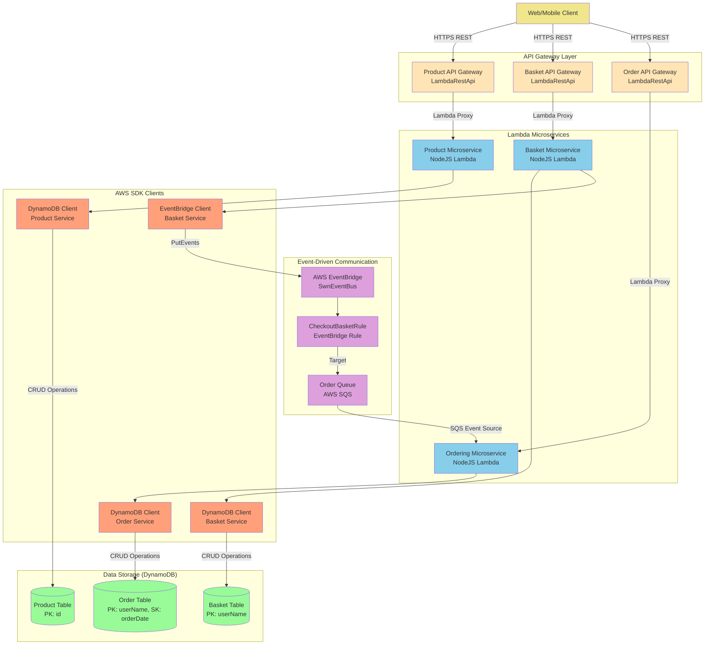
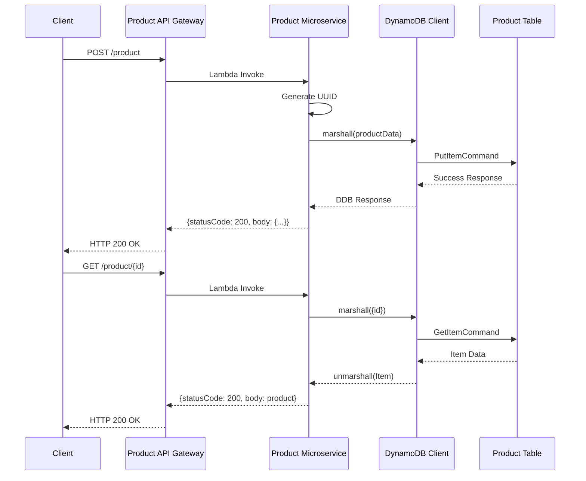
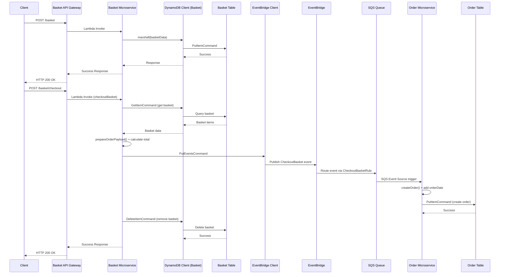
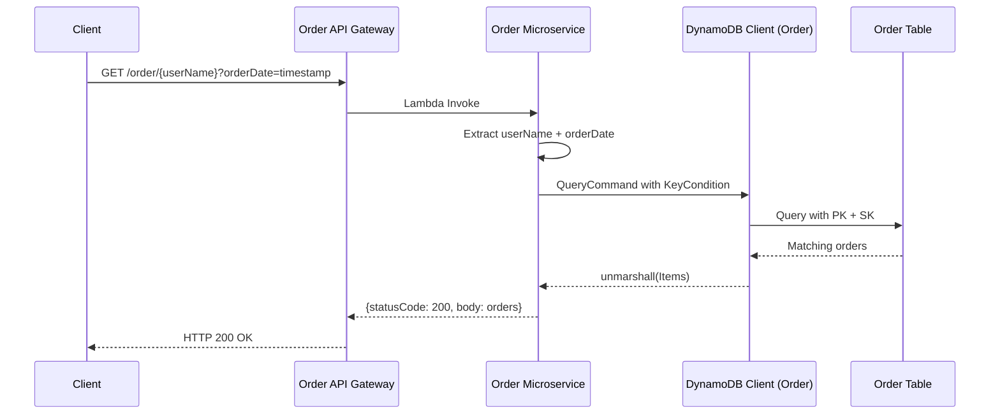

# AWS Microservices Architecture - Complete Documentation

## 1. COMPLETE SERVICE & API INVENTORY

### Infrastructure Components (CDK)

| Component Name | Type | Purpose/Responsibility | Technology/Framework | Location | Dependencies |
|---|---|---|---|---|---|
| `AwsMicroservicesStack` | CDK Stack | Main orchestrator stack that creates all infrastructure | AWS CDK v2.17.0 | `lib/aws-microservices-stack.ts` | All other components |
| `SwnDatabase` | CDK Construct | Manages all DynamoDB tables | AWS DynamoDB | `lib/database.ts` | None |
| `SwnMicroservices` | CDK Construct | Creates and configures all Lambda functions | AWS Lambda, Node.js 14.x | `lib/microservice.ts` | SwnDatabase tables |
| `SwnApiGateway` | CDK Construct | Creates REST API gateways for all services | AWS API Gateway | `lib/apigateway.ts` | SwnMicroservices functions |
| `SwnEventBus` | CDK Construct | Manages EventBridge for inter-service communication | AWS EventBridge | `lib/eventbus.ts` | SwnMicroservices, SwnQueue |
| `SwnQueue` | CDK Construct | Manages SQS queues for async processing | AWS SQS | `lib/queue.ts` | SwnMicroservices |

### Lambda Microservices

| Component Name | Type | Purpose/Responsibility | Technology/Framework | Location | APIs Exposed |
|---|---|---|---|---|---|
| `Product Microservice` | Lambda Function | CRUD operations for products, category filtering | Node.js 14.x, AWS SDK v3 | `src/product/index.js` | Product REST API |
| `Basket Microservice` | Lambda Function | Shopping cart management and checkout processing | Node.js 14.x, AWS SDK v3 | `src/basket/index.js` | Basket REST API |
| `Ordering Microservice` | Lambda Function | Order processing from events and API queries | Node.js 14.x, AWS SDK v3 | `src/ordering/index.js` | Order REST API |

### Database Tables (DynamoDB)

| Component Name | Type | Purpose/Responsibility | Technology/Framework | Schema |
|---|---|---|---|---|
| `product` | DynamoDB Table | Stores product catalog data | DynamoDB, PAY_PER_REQUEST | PK: `id` (String) |
| `basket` | DynamoDB Table | Stores user shopping baskets | DynamoDB, PAY_PER_REQUEST | PK: `userName` (String) |
| `order` | DynamoDB Table | Stores order history and details | DynamoDB, PAY_PER_REQUEST | PK: `userName` (String), SK: `orderDate` (String) |

### API Gateway Endpoints

| API Gateway | Service | Endpoint | HTTP Method | Purpose |
|---|---|---|---|---|
| `Product Service` | Product Microservice | `/product` | GET | Retrieve all products |
| `Product Service` | Product Microservice | `/product` | POST | Create new product |
| `Product Service` | Product Microservice | `/product/{id}` | GET | Get specific product |
| `Product Service` | Product Microservice | `/product/{id}` | PUT | Update product |
| `Product Service` | Product Microservice | `/product/{id}` | DELETE | Delete product |
| `Product Service` | Product Microservice | `/product/{id}?category=X` | GET | Filter products by category |
| `Basket Service` | Basket Microservice | `/basket` | GET | Get all baskets |
| `Basket Service` | Basket Microservice | `/basket` | POST | Create/update basket |
| `Basket Service` | Basket Microservice | `/basket/{userName}` | GET | Get user's basket |
| `Basket Service` | Basket Microservice | `/basket/{userName}` | DELETE | Delete user's basket |
| `Basket Service` | Basket Microservice | `/basket/checkout` | POST | Checkout basket (triggers event) |
| `Order Service` | Ordering Microservice | `/order` | GET | Get all orders |
| `Order Service` | Ordering Microservice | `/order/{userName}` | GET | Get user's orders (with optional orderDate filter) |

### Event-Driven Components

| Component Name | Type | Purpose/Responsibility | Technology/Framework | Location |
|---|---|---|---|---|
| `SwnEventBus` | EventBridge | Custom event bus for microservice communication | AWS EventBridge | Created by CDK |
| `CheckoutBasketRule` | EventBridge Rule | Routes checkout events to order queue | AWS EventBridge | Created by CDK |
| `OrderQueue` | SQS Queue | Buffers checkout events for order processing | AWS SQS | Created by CDK |

### Client Libraries & Utilities

| Component Name | Type | Purpose/Responsibility | Technology/Framework | Location |
|---|---|---|---|---|
| `ddbClient.js` (Product) | AWS SDK Client | DynamoDB client for product service | @aws-sdk/client-dynamodb v3.55.0 | `src/product/ddbClient.js` |
| `ddbClient.js` (Basket) | AWS SDK Client | DynamoDB client for basket service | @aws-sdk/client-dynamodb v3.55.0 | `src/basket/ddbClient.js` |
| `ddbClient.js` (Ordering) | AWS SDK Client | DynamoDB client for ordering service | @aws-sdk/client-dynamodb v3.58.0 | `src/ordering/ddbClient.js` |
| `eventBridgeClient.js` | AWS SDK Client | EventBridge client for publishing events | @aws-sdk/client-eventbridge v3.58.0 | `src/basket/eventBridgeClient.js` |

### Configuration & Deployment

| Component Name | Type | Purpose/Responsibility | Technology/Framework | Location |
|---|---|---|---|---|
| `aws-microservices.ts` | CDK App Entry Point | Initializes and deploys the CDK stack | AWS CDK v2.17.0 | `bin/aws-microservices.ts` |
| `cdk.json` | CDK Configuration | CDK app configuration and context settings | JSON | `cdk.json` |
| `package.json` | Node.js Package | Root package dependencies and scripts | Node.js/NPM | `package.json` |

## 2. COMPREHENSIVE SYSTEM ARCHITECTURE



## 3. API LAYER MAPPING

### Product Service API Endpoints

| Endpoint | Method | Handler Function | Request Format | Response Format | Consumers |
|---|---|---|---|---|---|
| `/product` | GET | `getAllProducts()` | None | `{message: string, body: Product[]}` | Web/Mobile Clients |
| `/product` | POST | `createProduct()` | `{name, description, price, category, ...}` | `{message: string, body: DDBResponse}` | Admin Clients |
| `/product/{id}` | GET | `getProduct()` | Path: `{id: string}` | `{message: string, body: Product}` | Web/Mobile Clients |
| `/product/{id}` | PUT | `updateProduct()` | Path: `{id: string}`, Body: `{field: value, ...}` | `{message: string, body: DDBResponse}` | Admin Clients |
| `/product/{id}` | DELETE | `deleteProduct()` | Path: `{id: string}` | `{message: string, body: DDBResponse}` | Admin Clients |
| `/product/{id}?category=X` | GET | `getProductsByCategory()` | Path: `{id: string}`, Query: `{category: string}` | `{message: string, body: Product[]}` | Web/Mobile Clients |

### Basket Service API Endpoints

| Endpoint | Method | Handler Function | Request Format | Response Format | Consumers |
|---|---|---|---|---|---|
| `/basket` | GET | `getAllBaskets()` | None | `{message: string, body: Basket[]}` | Admin Clients |
| `/basket` | POST | `createBasket()` | `{userName, items: [{productId, quantity, price, ...}]}` | `{message: string, body: DDBResponse}` | Web/Mobile Clients |
| `/basket/{userName}` | GET | `getBasket()` | Path: `{userName: string}` | `{message: string, body: Basket}` | Web/Mobile Clients |
| `/basket/{userName}` | DELETE | `deleteBasket()` | Path: `{userName: string}` | `{message: string, body: DDBResponse}` | Web/Mobile Clients |
| `/basket/checkout` | POST | `checkoutBasket()` | `{userName, firstName, lastName, email, address, paymentMethod}` | `{message: string, body: EventResponse}` | Web/Mobile Clients |

### Order Service API Endpoints

| Endpoint | Method | Handler Function | Request Format | Response Format | Consumers |
|---|---|---|---|---|---|
| `/order` | GET | `getAllOrders()` | None | `{message: string, body: Order[]}` | Admin Clients |
| `/order/{userName}` | GET | `getOrder()` | Path: `{userName: string}`, Query: `{orderDate?: string}` | `{message: string, body: Order[]}` | Web/Mobile Clients |

### Internal Event APIs

| Event Source | Event Type | Event Format | Target | Handler Function |
|---|---|---|---|---|
| Basket Microservice | `com.swn.basket.checkoutbasket` | `{Source, Detail: {userName, totalPrice, items, ...}, DetailType: "CheckoutBasket"}` | EventBridge → SQS → Order Service | `createOrder()` |

## 4. DATA FLOW TRACING

### Flow 1: Product Catalog Management


### Flow 2: Shopping Cart & Checkout Process


### Flow 3: Order Query Process


## 5. STORAGE LAYER MAPPING

### DynamoDB Tables Schema & Access Patterns

#### Product Table
- **Schema**: `PK: id (String)`
- **Access Patterns**:
  - GetItem by ID (Product Microservice)
  - Scan all products (Product Microservice)
  - Query with category filter (Product Microservice)
  - PutItem for create (Product Microservice)
  - UpdateItem for update (Product Microservice)
  - DeleteItem for delete (Product Microservice)

#### Basket Table
- **Schema**: `PK: userName (String)`
- **Access Patterns**:
  - GetItem by userName (Basket Microservice)
  - Scan all baskets (Basket Microservice - admin)
  - PutItem for create/update (Basket Microservice)
  - DeleteItem after checkout (Basket Microservice)

#### Order Table
- **Schema**: `PK: userName (String), SK: orderDate (String)`
- **Access Patterns**:
  - Query by userName (Order Microservice)
  - Query by userName + orderDate (Order Microservice)
  - Scan all orders (Order Microservice - admin)
  - PutItem for create (Order Microservice)

### Data Relationships
```mermaid
erDiagram
    PRODUCT {
        string id PK
        string name
        string description
        string imageFile
        number price
        string category
    }
    
    BASKET {
        string userName PK
        array items
    }
    
    ORDER {
        string userName PK
        string orderDate SK
        number totalPrice
        string firstName
        string lastName
        string email
        string address
        string paymentMethod
        string cardInfo
        array items
    }
    
    BASKET_ITEM {
        string productId
        number quantity
        string color
        number price
        string productName
    }
    
    PRODUCT ||--o{ BASKET_ITEM : "referenced by"
    BASKET ||--|| BASKET_ITEM : "contains"
    BASKET ||--|| ORDER : "transforms to"
```

## 6. EVENT-DRIVEN ARCHITECTURE COMPONENTS

### EventBridge Configuration
- **Event Bus Name**: `SwnEventBus`
- **Event Source**: `com.swn.basket.checkoutbasket`
- **Event Detail Type**: `CheckoutBasket`

### Event Flow Mapping
```mermaid
graph LR
    BasketMS[Basket Microservice<br/>checkoutBasket()] -->|PutEventsCommand| EventBus[SwnEventBus<br/>AWS EventBridge]
    EventBus --> CheckoutRule[CheckoutBasketRule<br/>Pattern: source + detailType]
    CheckoutRule -->|SqsQueue Target| OrderQueue[OrderQueue<br/>AWS SQS]
    OrderQueue -->|SqsEventSource<br/>batchSize: 1| OrderMS[Order Microservice<br/>sqsInvocation()]
    
    classDef lambda fill:#87CEEB
    classDef event fill:#DDA0DD
    classDef queue fill:#FFB6C1
    
    class BasketMS,OrderMS lambda
    class EventBus,CheckoutRule event
    class OrderQueue queue
```

### Event Message Format
```json
{
  "Source": "com.swn.basket.checkoutbasket",
  "DetailType": "CheckoutBasket",
  "Detail": {
    "userName": "swn",
    "totalPrice": 1820,
    "firstName": "John",
    "lastName": "Doe",
    "email": "john@example.com",
    "address": "123 Main St",
    "paymentMethod": "CreditCard",
    "items": [
      {
        "productId": "uuid",
        "quantity": 2,
        "price": 910,
        "productName": "iPhone"
      }
    ]
  },
  "EventBusName": "SwnEventBus"
}
```

## 7. CROSS-CUTTING CONCERNS

### Environment Variables Configuration
| Service | Environment Variable | Purpose | Example Value |
|---|---|---|---|
| Product MS | `DYNAMODB_TABLE_NAME` | Product table name | `product` |
| Product MS | `PRIMARY_KEY` | Primary key field name | `id` |
| Basket MS | `DYNAMODB_TABLE_NAME` | Basket table name | `basket` |
| Basket MS | `PRIMARY_KEY` | Primary key field name | `userName` |
| Basket MS | `EVENT_SOURCE` | EventBridge source | `com.swn.basket.checkoutbasket` |
| Basket MS | `EVENT_DETAILTYPE` | Event detail type | `CheckoutBasket` |
| Basket MS | `EVENT_BUSNAME` | EventBridge bus name | `SwnEventBus` |
| Order MS | `DYNAMODB_TABLE_NAME` | Order table name | `order` |
| Order MS | `PRIMARY_KEY` | Primary key field name | `userName` |
| Order MS | `SORT_KEY` | Sort key field name | `orderDate` |

### Error Handling Strategy
- **Centralized Error Response Format**:
  ```json
  {
    "statusCode": 500,
    "body": {
      "message": "Failed to perform operation.",
      "errorMsg": "Detailed error message",
      "errorStack": "Stack trace for debugging"
    }
  }
  ```
- **Logging**: Console.log for all operations and errors
- **Error Propagation**: All functions re-throw errors for Lambda-level handling

### Security & Access Control
- **IAM Permissions**: 
  - Lambda functions have DynamoDB read/write permissions via CDK grants
  - EventBridge PutEvents permission granted to Basket service
  - SQS permissions for Order service event source
- **API Authentication**: None implemented (consider adding API keys or Cognito)
- **Data Validation**: Minimal validation implemented

### Monitoring & Observability
- **CloudWatch Logs**: Automatic Lambda function logging
- **Custom Metrics**: None implemented
- **Distributed Tracing**: Not configured
- **Health Checks**: Not implemented

## 8. DEPLOYMENT ARCHITECTURE

### Infrastructure as Code (CDK)

```mermaid
graph TB
    subgraph "CDK Stack Components"
        MainStack[AwsMicroservicesStack]
        MainStack --> Database[SwnDatabase Construct]
        MainStack --> Microservices[SwnMicroservices Construct]
        MainStack --> APIGateway[SwnApiGateway Construct]
        MainStack --> Queue[SwnQueue Construct]
        MainStack --> EventBus[SwnEventBus Construct]
    end
    
    subgraph "AWS Resources Created"
        Database --> ProductTable[Product DynamoDB Table]
        Database --> BasketTable[Basket DynamoDB Table]
        Database --> OrderTable[Order DynamoDB Table]
        
        Microservices --> ProductLambda[Product Lambda Function]
        Microservices --> BasketLambda[Basket Lambda Function]
        Microservices --> OrderLambda[Order Lambda Function]
        
        APIGateway --> ProductAPIGW[Product API Gateway]
        APIGateway --> BasketAPIGW[Basket API Gateway]
        APIGateway --> OrderAPIGW[Order API Gateway]
        
        Queue --> SQSQueue[Order SQS Queue]
        EventBus --> CustomEventBus[SwnEventBus]
        EventBus --> EventRule[CheckoutBasketRule]
    end
    
    classDef cdk fill:#FF6B6B
    classDef aws fill:#4ECDC4
    
    class MainStack,Database,Microservices,APIGateway,Queue,EventBus cdk
    class ProductTable,BasketTable,OrderTable,ProductLambda,BasketLambda,OrderLambda,ProductAPIGW,BasketAPIGW,OrderAPIGW,SQSQueue,CustomEventBus,EventRule aws
```


### Technology Stack Summary
- **Runtime**: Node.js 14.x
- **Cloud Provider**: AWS
- **Infrastructure**: AWS CDK v2.17.0
- **API Layer**: AWS API Gateway (REST)
- **Compute**: AWS Lambda
- **Database**: Amazon DynamoDB
- **Messaging**: AWS EventBridge + SQS
- **AWS SDK**: v3 (latest modules)
- **Deployment**: CDK TypeScript

This documentation provides a complete view of the microservices architecture with every component, API, and data flow mapped and documented according to your requirements.
